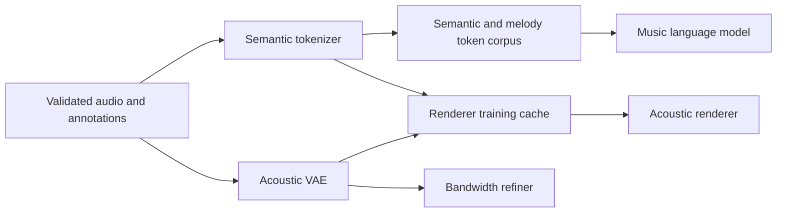

# Training

Open-Qwen-Music is trained as a dependency graph. The arrows below mean that the
artifact on the left must be frozen before the job on the right starts.



Tokenizer and VAE training can run in parallel after the base corpus is ready.
The language model cannot start before the tokenizer is frozen and the token
corpus has been materialized. Renderer training waits for both the tokenizer and
the VAE. Refiner training waits for the VAE, but can run in parallel with the
language model and renderer.

## Guides

| Workflow | Starts when | Output consumed by |
| --- | --- | --- |
| [Data preparation](docs/training/data-preparation.md) | Source dataset is available | Every model component |
| [Semantic tokenizer](docs/training/tokenizer.md) | Validated audio manifests are ready | LLM corpus and renderer cache |
| [Music language model](docs/training/language-model.md) | Frozen tokenizer and token corpus are ready | Text-to-music inference |
| [Acoustic VAE](docs/training/acoustic-vae.md) | Validated 48 kHz stereo audio is ready | Renderer cache, decoder, and refiner |
| [Acoustic renderer](docs/training/renderer.md) | Frozen tokenizer labels and VAE latents are ready | Acoustic latents for decoding |
| [Bandwidth refiner](docs/training/refiner.md) | Frozen VAE and paired reference audio are ready | Final 48 kHz stereo audio |

The [training workflow index](docs/training/README.md) lists the stage boundaries,
handoff checks, and the work that can run concurrently.

## Installation

```bash
python -m venv .venv
source .venv/bin/activate
pip install -e ".[train,render]"
pip install -e "./data_pipeline[gpu]"
```

Relocate datasets, model assets, checkpoints, outputs, and local caches without
editing the checked-in configurations:

```bash
export OQM_DATA_ROOT=/datasets/oqm
export OQM_MODEL_ROOT=/models
export OQM_CHECKPOINT_ROOT=/checkpoints/oqm
export OQM_OUTPUT_ROOT=/runs/oqm
export OQM_CACHE_ROOT=/local-cache/oqm
```

## Renderer data materialization

Renderer training consumes a release produced after the semantic Tokenizer and
Stage 2 VAE are frozen. Adapt the generic semantic-token release, then materialize
the sample manifests, VAE latents, text caches, crop windows, loudness values, and
semantic embedding:

```bash
oqm-adapt-renderer-semantics \
  --input-dir "$OQM_DATA_ROOT/llm/corpus" \
  --source-manifest "$OQM_DATA_ROOT/renderer/source.jsonl" \
  --output-dir "$OQM_DATA_ROOT/renderer-semantics"

oqm-materialize-renderer \
  --config configs/train/renderer.yaml \
  --source-manifest "$OQM_DATA_ROOT/renderer/source.jsonl" \
  --semantic-release "$OQM_DATA_ROOT/renderer-semantics" \
  --output-dir "$OQM_DATA_ROOT/renderer" \
  --tokenizer-checkpoint "$OQM_CHECKPOINT_ROOT/tokenizer/tokenizer.pt" \
  --vae-checkpoint "$OQM_CHECKPOINT_ROOT/vae/vae.pt" \
  --text-encoder "$OQM_MODEL_ROOT/Qwen3-Embedding-0.6B" \
  --calibration-report "$OQM_DATA_ROOT/llm/evaluation/semantic-calibration.json" \
  --semantic-top-k 384 \
  --device cuda
```

The command writes `renderer.resolved.yaml` beside the release-level `READY`.
Pass that generated configuration to the standard launcher. See the
[Renderer guide](docs/training/renderer.md) for the source-manifest contract,
output layout, and exact training command. Start Renderer training
from a fresh model and optimizer for 29,000 updates: 25,000 clean updates, a
1,000-update corruption ramp, and the remaining robust phase.

## Distributed launch

Every training recipe uses 64 processes through the same standard `torchrun`
wrapper. The examples use eight nodes with eight GPUs per node; run the command
on every node with a unique `NODE_RANK`.

```bash
NNODES=8 NODE_RANK=0 \
MASTER_ADDR=host0.example.net MASTER_PORT=29500 \
NPROC_PER_NODE=8 RDZV_ID=oqm-training \
  bash scripts/launch_torchrun.sh scripts/train.py tokenizer-stage1a
```

Run the command on every node and give each machine a unique `NODE_RANK` in
`[0, NNODES)`. An update budget is a number of optimizer updates; its wall-clock
duration depends on hardware, world size, sequence length, and input pipeline
throughput.

## Checkpoint semantics

- `--init-from` loads model weights for a new stage and starts a new optimizer,
  scheduler, and data state.
- `--resume-from` restores the same stage after interruption, including optimizer,
  scheduler, sampler, and random state.
- Acoustic VAE and refiner stages use `--vae-checkpoint` for the frozen VAE parent
  and `--resume` only for an interrupted run.
- Never use a newer tokenizer to label part of a corpus while retaining labels
  produced by an older tokenizer. Rebuild the complete downstream token corpus
  whenever the tokenizer checkpoint changes.

## CPU-compatible checks

These checks do not start training:

```bash
python -m compileall -q src scripts data_pipeline/src
python scripts/train.py --help
python -m pytest -q tests/test_train_router.py tests/test_torchrun_launcher.py
```
